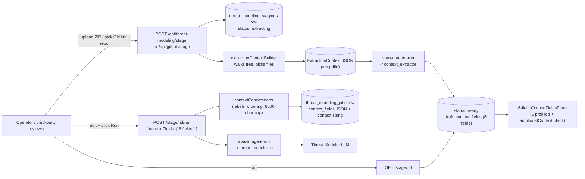

<!--
Plan source: .cursor/plans/add_deployment_context_field_a5829514.plan.md
This is a synced standalone copy for review; the implementation todos are listed
verbatim at the bottom of this document.
-->

# Add Deployment & Environment Context Field — Design Plan

> **Status:** Plan under review. Implementation has not started.

## Summary

Expose the `appsec-agent` `--context` capability in `ai-threat-modeler` for the third-party-reviewer persona (technically the **Operator** role in this codebase, since the literal `Auditor` role lacks `requireJobScheduling`). These users point at someone else's repo and don't know its deployment / stack / compliance scope, so a blank textarea is too high a bar.

V1 introduces a two-step flow:

1. Stage the repo, run `context_extractor` to draft five structured fields (`project_summary` / `security_context` / `deployment_context` / `developer_context` / `suggested_exclusions`).
2. Present them as **six editable inputs** (the five drafted fields plus a sixth `additional_context` the user fills in for things the extractor cannot infer), then concatenate all six into the `-c <text>` argument when spawning `agent-run -r threat_modeler`.

Both ZIP upload and GitHub import paths get the same UX. The legacy one-shot endpoints (`POST /api/threat-modeling` and `POST /api/github/import`) are **removed** in this PR; clients must migrate to the staging flow.

<!-- Implementation todos (mirrored from the plan source):
todos:
  - id: db-migration-job
    content: Add idempotent ADD COLUMN context TEXT (the flattened concatenated string actually passed to agent-run, kept for audit and re-run) and ADD COLUMN context_fields TEXT (JSON-serialized ContextFields object, kept for display and editing) migrations to threat_modeling_jobs in backend/src/db/database.ts; update the ThreatModelingJob row type
    status: pending
  - id: db-migration-staging
    content: Add new threat_modeling_stagings table (id, user_id, source_type, source_url, repo_name, git_branch, git_commit, git_ref, git_ref_type, repo_path, uploaded_zip_path, extracted_dir, status, extraction_error, draft_context_fields TEXT (JSON), extraction_raw, created_at, updated_at, expires_at) plus user_id and status indexes
    status: pending
  - id: model-job
    content: Thread optional context (string) and contextFields (object) through ThreatModelingJobModel.create in backend/src/models/threatModelingJob.ts; serialize contextFields to JSON
    status: pending
  - id: model-staging
    content: Add backend/src/models/threatModelingStaging.ts with create / findById / findActiveByUser / updateStatus / setDraftFields / markConsumed / markFailed / deleteStale methods; setDraftFields takes the parsed extractor output (5 fields) and persists it as JSON
    status: pending
  - id: extraction-input
    content: Add backend/src/services/extractionContextBuilder.ts that walks an extracted repo, builds tree_summary (capped depth and bytes), picks interesting files (package.json / pyproject.toml / pom.xml / go.mod / Cargo.toml / Gemfile, .github/workflows/**, .codefresh/**, Jenkinsfile, Dockerfile, terraform/**, helm/**, kustomize/**, CLAUDE.md, AGENTS.md, .cursor/rules/**, SECURITY.md, README.md), detects language by extension count, and serializes ExtractionContext JSON to a temp file
    status: pending
  - id: extraction-runner
    content: Add backend/src/services/contextExtractorRunner.ts that spawns `agent-run -r context_extractor --extract-context <file>` WITHOUT the ChdirMutex (the extractor reads its input via absolute path and writes to stdout, no cwd dependency, so it can run in parallel with any threat-modeler job). Captures stdout, parses CONTEXT_EXTRACTION_SCHEMA output (5 snake_case fields), renames keys to camelCase (project_summary→projectSummary, security_context→securityContext, deployment_context→deploymentContext, developer_context→developerContext, suggested_exclusions→suggestedExclusions), persists the renamed object as draft_context_fields on the staging row, stores the raw JSON in extraction_raw. Reads anthropicApiKey + anthropicBaseUrl + claudeCodeMaxOutputTokens from the same settings lookup the existing threat-modeler route uses
    status: pending
  - id: shared-agent-run-path
    content: Extract findAgentRunPath() from backend/src/routes/threatModeling.ts (lines 235-257) and backend/src/routes/chat.ts (lines 50-65) into backend/src/services/agentRunPath.ts; both existing call sites and the new contextExtractorRunner import from there. Pure refactor, no behavior change
    status: pending
  - id: context-concatenator
    content: Add backend/src/services/contextConcatenator.ts with concatContextFields(fields) → string that joins the six fields (project_summary, security_context, deployment_context, developer_context, suggested_exclusions, additional_context) with section labels in a fixed order, skipping empty sections, and applies an 8000-char hard cap. All-empty input returns the empty string (callers MUST treat as 'omit -c argv pair')
    status: pending
  - id: stage-route-upload
    content: Add POST /api/threat-modeling/stage to backend/src/routes/threatModeling.ts that accepts the multipart ZIP, extracts it, creates a staging row, and kicks off processStagingExtraction asynchronously
    status: pending
  - id: stage-route-github
    content: Add POST /api/github/stage to backend/src/routes/github.ts that downloads the zipball, extracts it, creates a staging row, and kicks off processStagingExtraction asynchronously
    status: pending
  - id: stage-route-poll
    content: Add GET /api/threat-modeling/stage/:id that returns the staging row's status, error (if any), and draftContextFields (the parsed 5-field draft from the extractor)
    status: pending
  - id: stage-route-run
    content: Add POST /api/threat-modeling/stage/:id/run that consumes the staging, validates the body's contextFields (per-field length caps - project_summary/security_context/deployment_context/suggested_exclusions ≤500, developer_context ≤2000, additional_context ≤2000; type guard each field), runs the concatenator to produce the final context string, creates the job using the existing extracted_dir, and kicks off processThreatModelingJob - includes idempotency (status='consumed' guard) so a double-click can't double-spawn
    status: pending
  - id: stage-route-cancel
    content: Add DELETE /api/threat-modeling/stage/:id that marks the staging as cancelled, removes the uploaded ZIP and extracted dir
    status: pending
  - id: stage-gc
    content: Extend backend/src/init/stuckJobWatchdog.ts (or add a parallel watchdog) to GC stagings older than 30 minutes. **Only sweep non-terminal statuses** (pending, extracting, ready, failed) - never touch consumed/cancelled/expired rows since their extracted_dir may be owned by an in-flight or completed threat-modeling job. For each stale row delete extracted dirs + uploaded ZIPs, mark row expired
    status: pending
  - id: remove-legacy-routes
    content: Delete the existing one-shot endpoints POST /api/threat-modeling (backend/src/routes/threatModeling.ts lines 1019-1118) and POST /api/github/import (backend/src/routes/github.ts lines 448 onward including processGitHubImport at lines 380-445). Replace with a 410 Gone handler that returns a JSON migration message pointing at /api/threat-modeling/stage and /api/github/stage; the 410 route stays for one release so out-of-tree clients see the migration path, then is removed in a follow-up
    status: pending
  - id: remove-legacy-frontend-api
    content: Remove api.threatModeling and api.importFromGitHub from frontend/lib/api.ts. Audit all call sites (frontend/components/ThreatModeling.tsx line 305, frontend/components/GitHubImport.tsx line 106) and replace with the new staging methods
    status: pending
  - id: remove-legacy-tests
    content: Delete or refactor existing tests that target the removed endpoints - backend route tests for POST / and POST /import (backend/src/__tests__/routes/threatModeling.test.ts, backend/src/__tests__/routes/github.test.ts), frontend unit tests in frontend/__tests__/ that exercise the removed api.threatModeling / api.importFromGitHub paths, and the legacy assertions in the existing GitHub e2e spec
    status: pending
  - id: spawn-arg
    content: In processThreatModelingJob, append -c <context> to agent-run argv when context is non-empty; update INFO log to include contextProvided/contextLength only (never the raw value)
    status: pending
  - id: openapi-paths
    content: Add the five new staging endpoints to backend/openapi.yaml under the Threat Modeling tag - POST /api/threat-modeling/stage (multipart), POST /api/github/stage (JSON), GET /api/threat-modeling/stage/{id}, POST /api/threat-modeling/stage/{id}/run (JSON body { contextFields }), DELETE /api/threat-modeling/stage/{id}
    status: pending
  - id: openapi-schemas
    content: Add ThreatModelingStaging + StagingStatus + ContextFields schemas; ContextFields has six optional string properties (projectSummary ≤500, securityContext ≤500, deploymentContext ≤500, developerContext ≤2000, suggestedExclusions ≤500, additionalContext ≤2000); add contextFields ($ref ContextFields, nullable) and context (string, nullable, maxLength 8000) to the existing ThreatModelingJob schema in backend/openapi.yaml
    status: pending
  - id: openapi-remove-legacy
    content: Remove the existing POST /api/threat-modeling endpoint definition from backend/openapi.yaml (lines 611-671) since the route is being deleted. The schema components and the GET /jobs/* / GET /reports/* endpoints stay. Also document the new 410-Gone shape on the deprecated path so API consumers see the migration target
  - id: openapi-validation
    content: Confirm the updated backend/openapi.yaml still loads cleanly at server startup (existing logic in backend/src/index.ts lines 60-66) and on /api-docs; optionally add a small test that parses the file with @apidevtools/swagger-parser if not already present
    status: pending
  - id: api-client
    content: Add api.stageThreatModelingUpload, api.stageGitHubImport, api.getThreatModelingStage, api.runThreatModelingStage (body { contextFields }), api.cancelThreatModelingStage to frontend/lib/api.ts. The legacy api.threatModeling and api.importFromGitHub are removed by the remove-legacy-frontend-api todo
    status: pending
  - id: job-type
    content: Add context (string | null) and contextFields (ContextFields | null) to ThreatModelingJob in frontend/types/threatModelingJob.ts; add new ContextFields and ThreatModelingStaging types
    status: pending
  - id: staging-hook
    content: Add frontend/hooks/useThreatModelingStaging.ts with the staging state machine (idle | extracting | ready | failed | running), a polling loop that calls GET /stage/:id every ~3s with backoff (stopping on ready/failed/404), and a per-field state object that initializes from the draft and tracks user edits across all six fields including the user-only additionalContext
    status: pending
  - id: context-fields-form
    content: Add frontend/components/ContextFieldsForm.tsx - a reusable card component that renders six labeled, individually-capped textareas (projectSummary, securityContext, deploymentContext, developerContext, suggestedExclusions, additionalContext) each with its own helper text, char counter, and focused privacy notice on additionalContext (Do not paste secrets, API keys, or PHI). Used by both the upload and GitHub forms
    status: pending
  - id: upload-form
    content: Refactor frontend/components/ThreatModeling.tsx upload form into a two-step flow - Step 1 button is Analyze repository (calls stageThreatModelingUpload); Step 2 renders ContextFieldsForm prefilled with the draft, status indicator, character counters, and a Run threat model button that calls runThreatModelingStage with the edited contextFields object
    status: pending
  - id: github-form
    content: Refactor frontend/components/GitHubImport.tsx into the same two-step flow - Import & Create Job becomes Analyze repository + Run threat model; reuses ContextFieldsForm
    status: pending
  - id: failure-fallback
    content: When staging.status is failed, surface a Couldn't auto-generate context banner above the ContextFieldsForm but keep all six fields editable so the user can fill in any combination and still click Run (Run is enabled even if every field is empty - empty context degrades gracefully to the no-context baseline). Run button is **disabled** while status === 'extracting' (skeleton state); enabled in 'ready' and 'failed'
    status: pending
  - id: session-expired-ux
    content: When GET /stage/:id or POST /stage/:id/run returns 404 (the staging row was GC'd after 30 minutes of inactivity), the staging hook detects this and the form shows a Session expired - please re-import the repository banner with a Reset button that returns the form to Step 1
    status: pending
  - id: directory-picker-preserve
    content: When refactoring the upload form into Step 1 / Step 2, preserve both directory-picker code paths from the existing form - the modern FileSystemDirectoryHandle branch (frontend/components/ThreatModeling.tsx around lines 230-260) and the webkitdirectory legacy fallback. Step 1 keeps the existing directory-picker UI verbatim
    status: pending
  - id: cancel-flow
    content: Add a Cancel button to the staging UI that calls api.cancelThreatModelingStage and resets the form to Step 1
    status: pending
  - id: job-detail-display
    content: On the job detail view in ThreatModeling.tsx, render a collapsed Context used card that shows each populated field as a labeled section (project summary / security / deployment / developer guidance / exclusions / additional notes) with expand toggles per section
    status: pending
  - id: tests-backend-unit-builder
    content: Backend unit tests for extractionContextBuilder against fixture trees - asserts file selection, byte cap, language detection, tree_summary shape
    status: pending
  - id: tests-backend-unit-runner
    content: Backend unit tests for contextExtractorRunner with mocked spawn - asserts argv shape, parses 5-field extractor JSON, persists the parsed object as draft_context_fields, persists raw JSON in extraction_raw, handles malformed JSON gracefully
    status: pending
  - id: tests-backend-unit-concatenator
    content: Backend unit tests for contextConcatenator - empty fields skipped, ordering preserved, label format stable, 8000-char hard cap applied, single empty fields object returns empty string (not crash)
    status: pending
  - id: tests-backend-unit-staging-model
    content: Backend unit tests for ThreatModelingStagingModel - create / setDraftFields / markConsumed / markFailed / deleteStale state transitions and queries; round-trip JSON serialization of draft_context_fields
    status: pending
  - id: tests-backend-unit-routes
    content: Backend unit tests for stage routes - validation (file size, missing fields, per-field length caps - reject when developerContext > 2000, when projectSummary > 500, etc.), staging row created on POST, polling returns expected statuses, run rejects when status is not ready, run rejects on second call (consumed-guard), cancel cleans up files
    status: pending
  - id: tests-backend-supertest
    content: Backend integration test (Jest + supertest, mocked child_process.spawn) that walks a happy-path stage flow end to end - upload → poll → ready → run with edited contextFields → asserts spawn argv contains '-c <concatenated-string>' that includes labels for every populated section in the expected order, and the extracted dir is reused (no re-extraction)
    status: pending
  - id: tests-frontend-hook
    content: Frontend unit tests for useThreatModelingStaging - covers idle→extracting→ready transitions, polling cadence with fake timers, abort on unmount, failure path, six-field state initialization from draft, per-field edit tracking, additionalContext stays empty until user types
    status: pending
  - id: tests-frontend-context-fields-form
    content: Frontend unit tests for ContextFieldsForm - all six fields render with correct labels and helper text, char counters update per field, per-field maxLength enforced, empty fields don't break submit, additionalContext shows the secrets/PHI privacy notice
    status: pending
  - id: tests-frontend-forms
    content: Frontend unit tests for the upload and GitHub two-step forms - Step 1 disables until selection valid, Step 2 spinner renders, draft populates the five extractor fields (additionalContext stays blank), edits are preserved when toggling between fields, Run button calls runThreatModelingStage with the contextFields object containing all six fields
    status: pending
  - id: tests-e2e-upload
    content: Add Playwright spec frontend/e2e/upload-context.spec.ts that stubs the staging endpoints (POST /stage returns 202, GET /stage/:id returns extracting then ready with a fixture draft populating five fields, POST /stage/:id/run returns the created job), drives Step 1 → spinner → six-field form populated with draft → user edits two fields and types into additionalContext → Run, asserts run-body contextFields matches the edited values for all six fields
    status: pending
  - id: tests-e2e-github
    content: Refactor frontend/e2e/github-import.spec.ts to the new two-step flow - assert the staging draft populates the five extractor fields, the user edits, the user types into additionalContext, the run-body contextFields contains the edited values
    status: pending
  - id: tests-e2e-failure
    content: Add a Playwright spec that stubs GET /stage/:id to return failed and asserts the manual fallback message + textarea remains editable + Run still works with manually-typed context
    status: pending
  - id: tests-e2e-stub
    content: Extend frontend/e2e/helpers/stubApi.ts and the fixture so completed jobs echo a context field, and add a new staging-fixture (sample draft) used by the new specs; ensure the existing dfd-tab and dfd-export specs still pass with the updated job listing shape
    status: pending
isProject: false
-->

## Overview

The upstream `appsec-agent` CLI already accepts `-c, --context <text>` for the `threat_modeler` role and threads it into the system prompt under an `IMPORTANT DEPLOYMENT & ENVIRONMENT CONTEXT` block (see [appsec-agent main.ts](../../appsec-agent/src/main.ts) lines 944-983). This project does not yet expose it.

The primary user is the **third-party-reviewer persona** — someone pointing at a repo they don't own and don't know intimately. In this codebase that maps to the **Operator** role (and Admin); the literal `Auditor` role currently lacks `requireJobScheduling` and is a viewer. A blank textarea is too high a bar for the third-party reviewer, so v1 introduces a **staging step** that runs the existing `context_extractor` role against the freshly imported repo, drafts five structured fields, and presents them to the user as **six labeled, individually editable inputs**: the five extractor fields (`projectSummary`, `securityContext`, `deploymentContext`, `developerContext`, `suggestedExclusions`) plus a sixth `additionalContext` the user fills in for things the extractor cannot infer (compliance scope, network topology, in/out-of-scope, customer constraints). All six are concatenated server-side into a single `-c <text>` string when spawning `agent-run -r threat_modeler`. Both the ZIP upload and the GitHub import paths get the same two-step UX. The agent integration point stays a single free-form `--context` string, so no upstream agent changes are needed.

The legacy one-shot endpoints (`POST /api/threat-modeling` and `POST /api/github/import`) are **removed** in this PR. They become 410 Gone with a JSON migration body for one release, then are deleted in a follow-up. The frontend no longer references them. Anyone integrating directly against the API must migrate to the staging flow.

## Data flow

## Architecture decisions

- **Six editable fields, not one textarea.** Third-party reviewers find structured prompts easier to fill out. Five come from the extractor (`projectSummary` / `securityContext` / `deploymentContext` / `developerContext` / `suggestedExclusions`); the sixth (`additionalContext`) is blank by default and lets the user add things the extractor cannot infer.
- **All six fields are sent to the threat modeler.** Even `suggestedExclusions` (originally aimed at code-scanners) is included because labeling non-production paths gives STRIDE useful scoping signal ("threats in `tests/` are out of scope"). `projectSummary` orients the model. The concatenation order is fixed: project → security → deployment → developer → exclusions → additional, with a section label per field.
- **Per-field length caps mirror the extractor schema** plus a generous `additionalContext` budget: `projectSummary` / `securityContext` / `deploymentContext` / `suggestedExclusions` ≤ 500, `developerContext` ≤ 2000, `additionalContext` ≤ 2000. Worst-case concatenation is ~6000 chars; the final string is hard-capped at **8000 chars** to give headroom for labels and separators without bloating the prompt.
- **Empty contextFields means no `-c` flag.** If `concatContextFields(...)` returns the empty string, the spawn argv contains **no** `-c <text>` pair (not `-c ""`). The threat-modeler degrades to its existing zero-context behavior verbatim.
- **Persistence is denormalized on purpose.** Both `threat_modeling_jobs` and `threat_modeling_stagings` store the per-field object as JSON (`context_fields` / `draft_context_fields`) for display + editing and the **flattened concatenated string** (`context`) that was actually passed to `agent-run`. Display reads the structured object; audit reads the literal string. A future re-run can rebuild the string from the fields without losing fidelity.
- **Casing rename at the runner boundary.** The upstream extractor schema is **snake_case** (`project_summary`, `security_context`, `deployment_context`, `developer_context`, `suggested_exclusions`). This codebase persists, displays, and APIs everything as **camelCase** (`projectSummary`, etc.). The rename happens exactly once, in `contextExtractorRunner` after parsing the agent's stdout. Past that boundary nothing references the snake_case form.
- **Idempotent run.** `POST /stage/:id/run` rejects with 409 if the staging row's `status` is already `consumed`. Prevents a double-click from spawning two threat-modeler jobs against the same extracted dir.
- **Extractor runs *without* the chdir mutex.** Threat-modeler jobs hold `ChdirMutex` because they `process.chdir()` into the extracted dir. The extractor reads its input via absolute path and writes structured output to stdout — no cwd dependency. So `contextExtractorRunner` spawns *without* acquiring the mutex, which means a user can stage a new repo while another user's threat-modeler is still running. Without this, the staging UX collapses into a serialized queue behind multi-minute jobs.
- **Reuse the extracted dir.** Stage extracts the ZIP once into `extracted_dir`. When the user clicks Run, we transfer ownership to the new `threat_modeling_jobs` row (`repo_path` = same `extracted_dir`) instead of re-extracting. `processThreatModelingJob` is taught to skip its own extract step when the row already has `extracted_dir` set. Cleanup of the extracted dir at job end is unchanged — the existing `processThreatModelingJob` cleanup already removes whatever is in `extracted_dir` regardless of who put it there.
- **Staging GC excludes terminal rows.** GC only sweeps non-terminal statuses (`pending`, `extracting`, `ready`, `failed`) older than 30 minutes. `consumed` / `cancelled` / `expired` rows are immutable history — never touched, so the GC can't delete an `extracted_dir` out from under an in-flight or completed threat-modeling job. Piggybacks on the existing `stuckJobWatchdog` cadence ([backend/src/init/stuckJobWatchdog.ts](backend/src/init/stuckJobWatchdog.ts)).
- **Failure fallback is manual entry.** If the extractor fails or times out (>120s), the staging row goes to `status=failed`, `draft_context_fields` stays null, and all six fields render empty and editable. Run still works with whatever the user types — including with all six fields blank, which degrades gracefully to the no-context baseline.
- **Session-expired UX.** If GET `/stage/:id` or POST `/stage/:id/run` returns 404 (the staging row was GC'd while the user idled past 30 minutes), the form surfaces a *Session expired — please re-import the repository* banner with a Reset button that returns to Step 1. The frontend hook treats 404 as terminal.
- **Run button is gated on status.** Disabled while `status === 'extracting'` (skeleton state). Enabled in `ready` (with the prefilled draft) and `failed` (with all-empty fields). Disabled while a `run` request is in flight to prevent the double-click race the 409 guard catches.
- **Legacy endpoints removed, not wrapped.** `POST /api/threat-modeling` and `POST /api/github/import` become 410 Gone for one release, with a JSON body pointing at the new staging endpoints, then deleted. The compat-wrapper option was rejected because running the extractor inline would regress sub-second `200` responses to ~30-90s, breaking existing API consumers and timeouts.

## Backend

### 1. DB

In [backend/src/db/database.ts](backend/src/db/database.ts):

- Idempotent `ADD COLUMN context TEXT` on `threat_modeling_jobs` — the flattened concatenated string actually passed to `agent-run`, kept for audit + re-run.
- Idempotent `ADD COLUMN context_fields TEXT` on `threat_modeling_jobs` — JSON-serialized `ContextFields` object (the six per-field values, used for display and editing).
- Idempotent `ADD COLUMN extracted_dir TEXT` and `ADD COLUMN uploaded_zip_path TEXT` on `threat_modeling_jobs` if not already present (check `PRAGMA table_info` first), so the run step can hand off the staged dir without re-extracting.
- New `CREATE TABLE IF NOT EXISTS threat_modeling_stagings` with the columns listed in the `db-migration-staging` todo. Indexes on `user_id` and `status`. Note: `draft_context_fields` is `TEXT` (JSON-serialized).
- Update the `ThreatModelingJob` row type and add `ThreatModelingStaging` and `ContextFields` row types.

### 2. Models

- [backend/src/models/threatModelingJob.ts](backend/src/models/threatModelingJob.ts): add `context?: string | null` and `contextFields?: ContextFields | null` to `create(...)` (line 18), serialize `contextFields` with `JSON.stringify` before insertion. Add `extractedDir?: string | null` so a staged job reuses the extracted dir. `findById` deserializes `context_fields` lazily (or via a small `parseRow` helper).
- New [backend/src/models/threatModelingStaging.ts](backend/src/models/threatModelingStaging.ts): full CRUD per the `model-staging` todo. State machine: `pending → extracting → (ready | failed) → consumed | cancelled | expired`. `setDraftFields(id, fields, rawJson)` takes the parsed extractor output (5 fields) and persists it as JSON; `findById` returns the row with `draft_context_fields` already deserialized.

### 3. Services

New files:

- [backend/src/services/extractionContextBuilder.ts](backend/src/services/extractionContextBuilder.ts):
  - `buildExtractionContext(extractedDir: string, repoName: string, gitBranch: string|null, gitCommit: string|null): ExtractionContext` (the input shape from [appsec-agent context_extraction.ts](../../appsec-agent/src/schemas/context_extraction.ts) lines 21-29).
  - **Required fields produced:** `owner` (from repo URL or `unknown` for upload), `repo` (= `repoName`), `description: string | null` (best-effort — first non-empty paragraph of the README, capped at 500 chars; otherwise `null`), `language: string | null` (most common language by file count, or `null` if no recognizable files), `languages: Record<string, number>`, `tree_summary: string | null`, `files: ExtractionFile[]` (always an array; empty if nothing matched, never undefined — the upstream schema ([context_extraction.ts](../../appsec-agent/src/schemas/context_extraction.ts) lines 61-63) throws on a non-array).
  - Walks the directory with depth cap (~6 levels) and per-file size cap (~256 KB) and total-bytes cap (~5 MB).
  - File selection allow-list (manifests / CI / IaC / security docs) per the `extraction-input` todo.
  - Language detection by file-extension count (returns `Record<string, number>`).
  - Builds a one-line-per-entry `tree_summary` with directory/file size hints.
  - **Edge case:** an empty repo or one with zero recognizable files still produces a valid `ExtractionContext` (empty `files`, empty `languages`, null `language`). The extractor will return mostly-empty fields, which the user fills in manually.

- [backend/src/services/contextExtractorRunner.ts](backend/src/services/contextExtractorRunner.ts):
  - `runContextExtractor(stagingId, extractedDir, anthropicApiKey, anthropicBaseUrl, claudeCodeMaxOutputTokens): Promise<void>`.
  - Builds the `ExtractionContext`, writes JSON to a temp file, spawns `agent-run -r context_extractor --extract-context <file>` **without acquiring `ChdirMutex`** — the extractor reads its input via absolute path and writes to stdout, so it doesn't need to own the process cwd. This lets a user stage a new repo while another user's threat-modeler job is running.
  - Resolves the agent-run binary via `findAgentRunPath()` from the new shared `backend/src/services/agentRunPath.ts` (extracted from the duplicate copies in `routes/threatModeling.ts` and `routes/chat.ts`).
  - Reads `anthropicApiKey`, `anthropicBaseUrl`, and `claudeCodeMaxOutputTokens` from the same settings lookup the existing threat-modeler route uses (around lines 441-446 / 690-693 of `routes/threatModeling.ts`). Passes them through env / argv identically.
  - Captures stdout, parses the `CONTEXT_EXTRACTION_SCHEMA` output (5 **snake_case** fields), renames keys to camelCase (`project_summary` → `projectSummary`, `security_context` → `securityContext`, `deployment_context` → `deploymentContext`, `developer_context` → `developerContext`, `suggested_exclusions` → `suggestedExclusions`), then calls `ThreatModelingStagingModel.setDraftFields(stagingId, renamedFields, rawJson)`. Past this boundary nothing references the snake_case form.
  - **Does not** concatenate; concatenation only happens at `run` time with the user-edited fields.
  - **Field-cap defense:** if any extractor field exceeds the per-field cap (e.g., the LLM returns a `developer_context` of 3000 chars), truncate to the cap with a trailing `…` rather than failing the staging row. Log a warning. The user can still see and edit the truncated draft.
  - On failure (spawn error / non-zero exit / unparseable JSON / timeout 120s) → `markFailed(stagingId, error)`. Never throws to the caller; the staging row is the source of truth.

- [backend/src/services/agentRunPath.ts](backend/src/services/agentRunPath.ts) (extracted from existing duplicates):
  - Exports `findAgentRunPath(): string`. Body is the existing 8-path search ([backend/src/routes/threatModeling.ts](backend/src/routes/threatModeling.ts) lines 235-257). Imported by `routes/threatModeling.ts`, `routes/chat.ts`, and `services/contextExtractorRunner.ts`. Pure refactor; both existing callers' tests still pass.

- [backend/src/services/contextConcatenator.ts](backend/src/services/contextConcatenator.ts):
  - `concatContextFields(fields: ContextFields): string` — builds a single string from the six fields in fixed order (project → security → deployment → developer → exclusions → additional). Each populated field becomes a labeled section like `Project: <value>\n\n`. Empty / whitespace-only fields are skipped (no empty sections). All-empty input returns the **empty string** — callers MUST treat empty as "skip the `-c` argv pair", not "pass `-c ""`". Hard-capped at 8000 chars (truncate with a trailing `[truncated]` marker if hit).
  - Pure function. Used by the `run` route only (the legacy compat wrappers are removed, see "Legacy endpoints" below).

### 4. Routes

In [backend/src/routes/threatModeling.ts](backend/src/routes/threatModeling.ts):

- `POST /api/threat-modeling/stage` — accepts the multipart ZIP using the **same multer instance** (`upload`) that the legacy route used (preserves `dest: 'uploads/threat-modeling/'` and the 2GB limit), then: extracts the ZIP, creates a `threat_modeling_stagings` row with `status=pending`, returns `202 { stagingId, status: 'pending' }`, then asynchronously calls `runContextExtractor`. Status flips to `extracting` once the extractor spawns. **Auth:** `authenticateToken + requireJobScheduling` (same gate as the removed legacy route, so Operators and Admins can call it but Auditors cannot).
- `GET /api/threat-modeling/stage/:id` — `findById`, ownership check on `user_id`, return `{ stagingId, status, draftContextFields, extractionError, expiresAt }` (the parsed 5-field draft, or `null` while still extracting / on failure). Returns `404` if not found OR if the row is `expired` / past `expires_at` (so a polling client gets the same signal as a row that was GC'd, and the frontend can show its "session expired" UX uniformly).
- `POST /api/threat-modeling/stage/:id/run` — body `{ contextFields?: ContextFields }`. Validate types and **per-field caps** (project/security/deployment/exclusions ≤ 500, developer ≤ 2000, additional ≤ 2000). If `status !== 'ready' && status !== 'failed'` → 409. Run `concatContextFields(...)` to produce the final `--context` string (≤ 8000). Create the `threat_modeling_jobs` row with **both** the structured `contextFields` (JSON) and the flattened `context` (the concatenated string), and the staged `extracted_dir`. `markConsumed(stagingId)`. Kick off `processThreatModelingJob` (which sees `extractedDir` already set and skips its extract step). Returns `404` if the staging row is missing / expired (frontend shows "session expired").
- `DELETE /api/threat-modeling/stage/:id` — ownership check, mark `cancelled`, delete extracted dir + uploaded ZIP. Idempotent: deleting an already-cancelled row returns `204`.
- `processThreatModelingJob` (line 410): append `'-c', context` to `agentRunCommand` (lines 666-674) **only when `context` is a non-empty string**. Empty / null → omit the flag entirely (do not pass `-c ""`). Skip the extract-ZIP step when `extracted_dir` is already set on the job row. Update the INFO log at line 640 to include `contextProvided=true|false, contextLength=N, contextFieldsPresent=[<list of populated field names>]` (never any raw values).
- **Legacy `POST /`** (lines 1019-1118): replaced with a `410 Gone` handler that returns `{ error: 'gone', message: 'POST /api/threat-modeling has been removed. Use POST /api/threat-modeling/stage followed by POST /api/threat-modeling/stage/:id/run.', migrate: { stage: '/api/threat-modeling/stage', run: '/api/threat-modeling/stage/:id/run' } }`. The 410 handler is kept for one release, then the route is deleted entirely.

In [backend/src/routes/github.ts](backend/src/routes/github.ts):

- `POST /api/github/stage` — does the existing zipball download + extract (lines 405-431) but ends in a staging row, not a job row. Asynchronously runs the extractor. Same auth gate as above.
- **Legacy `POST /api/github/import`** (line 448) and the `processGitHubImport` helper (lines 380-445) are deleted. The route is replaced with the same `410 Gone` JSON response pointing at `/api/github/stage` + `/api/threat-modeling/stage/:id/run`.

### 5. GC

In [backend/src/init/stuckJobWatchdog.ts](backend/src/init/stuckJobWatchdog.ts):

- Extend the periodic sweep to also call `ThreatModelingStagingModel.deleteStale(thresholdMs = 30 * 60 * 1000)`. For each stale row: hard-delete the row, remove `extracted_dir` and `uploaded_zip_path` from disk, log a single INFO line.

### 6. OpenAPI / Swagger

The backend ships [backend/openapi.yaml](backend/openapi.yaml) and serves it via `swagger-ui-express` at `/api-docs` (wired in [backend/src/index.ts](backend/src/index.ts) lines 13, 58-83). All API surface changes must be reflected there.

**New paths (added under the existing `Threat Modeling` tag, alongside lines 611-869):**

- `POST /api/threat-modeling/stage` — multipart form with `repository` (binary, required), optional `repoName` / `gitBranch` / `gitCommit`. Responses: `202 { stagingId, status: 'pending' }`, plus `400` / `401` / `403` / `413` (file too large) / `500`.
- `POST /api/github/stage` — JSON body `{ repoUrl, gitRef, gitRefType, repoName? }` (mirrors the existing `/api/github/import` shape). Responses: `202 { stagingId, status: 'pending' }`, plus standard error refs.
- `GET /api/threat-modeling/stage/{id}` — path param `id` (uuid). `200` with `ThreatModelingStaging` schema (including `draftContextFields: $ref ContextFields | null`). `401` / `403` (not owner) / `404`.
- `POST /api/threat-modeling/stage/{id}/run` — path param `id`, JSON body `{ contextFields?: ContextFields }` with per-field length validation enforced by the schema's `maxLength`. `200 { jobId, job: ThreatModelingJob }`. `400` (bad fields / cap exceeded) / `401` / `403` / `404` / `409` (status not ready/failed, or already consumed) / `500`.
- `DELETE /api/threat-modeling/stage/{id}` — `204`. `401` / `403` / `404`.

**New schemas (added in `components.schemas` near `ThreatModelingJob` at line 1397):**

- `ContextFields`:
  - `projectSummary: { type: string, nullable: true, maxLength: 500 }`
  - `securityContext: { type: string, nullable: true, maxLength: 500 }`
  - `deploymentContext: { type: string, nullable: true, maxLength: 500 }`
  - `developerContext: { type: string, nullable: true, maxLength: 2000 }`
  - `suggestedExclusions: { type: string, nullable: true, maxLength: 500 }`
  - `additionalContext: { type: string, nullable: true, maxLength: 2000, description: 'Free-form notes from the reviewer for things the extractor cannot infer (compliance scope, network topology, in/out-of-scope, etc.)' }`
- `ThreatModelingStaging`:
  - `id: string (uuid)`, `status: $ref StagingStatus`, `draftContextFields: $ref ContextFields | null` (the parsed 5-field extractor draft; `additionalContext` is always null in a draft), `extractionError: string|null`, `expiresAt: string (date-time)`, `sourceType: 'upload'|'github'`, `repoName: string|null`, `gitBranch: string|null`, `gitCommit: string|null`, `gitRef: string|null`, `gitRefType: 'branch'|'tag'|'commit'|null`, `createdAt`, `updatedAt`.
- `StagingStatus`: enum `pending | extracting | ready | failed | consumed | cancelled | expired`, with descriptions per state.

**Updated `ThreatModelingJob` schema (lines 1397-1462):**

- Add `contextFields: { $ref: '#/components/schemas/ContextFields', nullable: true, description: 'Per-field context inputs as edited by the user before the run.' }`.
- Add `context: { type: string, nullable: true, maxLength: 8000, description: 'Flattened concatenation of contextFields that was actually passed to agent-run as -c <text>.' }`.

**Removed / deprecated existing endpoints:**

- `POST /api/threat-modeling` (line 611-671): the path entry is **removed** from `openapi.yaml`. The route returns `410 Gone` with a migration JSON body. Document the 410 response under the `/api/threat-modeling/stage` path's `description` so consumers reading the spec can find the migration target.
- `POST /api/github/import`: never had an `openapi.yaml` entry. Its 410 handler is documented inline in code comments only; spec-level documentation is out of scope for this PR (matches the Out-of-scope note below about backfilling undocumented `/api/github/*` endpoints).

**Validation:**

- The server already validates the YAML at startup ([backend/src/index.ts](backend/src/index.ts) lines 60-66) and falls back to a minimal stub if it fails to parse. After the edit, smoke-check `npm run dev` boots clean and `/api-docs` renders the new endpoints.
- Optionally add a small Jest test that parses `openapi.yaml` with `@apidevtools/swagger-parser` (already a transitive dep) and asserts the new operation IDs / schemas exist. This is a cheap regression check.

## Frontend

### 7. Types and API client

- [frontend/types/threatModelingJob.ts](frontend/types/threatModelingJob.ts): add `context?: string | null` and `contextFields?: ContextFields | null` to `ThreatModelingJob`. Export new `ContextFields` and `ThreatModelingStaging` interfaces mirroring the backend. `ContextFields` is duplicated across backend (model row type), frontend (this file), and OpenAPI (`#/components/schemas/ContextFields`) — three sources of truth, three drift risks. Defense: a single Jest test that imports the OpenAPI YAML and asserts the property keysets match the TypeScript interface. Also acceptable: a code comment at each definition site listing the other two.
- [frontend/lib/api.ts](frontend/lib/api.ts): add five new methods per the `api-client` todo. `runThreatModelingStage(stagingId, contextFields: ContextFields)` sends the structured object. **Remove** `api.threatModeling` and `api.importFromGitHub` — they have no surviving call sites once `ThreatModeling.tsx` and `GitHubImport.tsx` are refactored to the staging flow. Audit references with a project-wide grep before deleting; existing unit tests that target them are deleted by the `remove-legacy-tests` todo.

### 8. Staging state machine hook

New [frontend/hooks/useThreatModelingStaging.ts](frontend/hooks/useThreatModelingStaging.ts):

- States: `idle | extracting | ready | failed | running | expired`.
- Actions: `startUpload(zipFile, repoName?)`, `startGitHub(params)`, `cancel()`, `run(fields: ContextFields)`, `setField(name, value)`, `reset()`.
- Internal `fields: ContextFields` state initializes from the staging `draftContextFields` once available (with `additionalContext` blank); user edits flow through `setField` and are preserved across status transitions.
- Polls `GET /stage/:id` every 3 seconds with linear backoff, stops on `ready` / `failed` / 404, hard timeout at 180 seconds.
- A 404 response from either `GET /stage/:id` or `POST /stage/:id/run` transitions to the terminal `expired` state and clears `stagingId`. The form renders the *Session expired* banner and a Reset button (calls `reset()` to return to `idle`).
- Aborts polling on unmount.
- Returns `{ status, stagingId, fields, draftFields, error, startUpload, startGitHub, run, cancel, setField, reset }`.

### 9. ContextFieldsForm (shared component)

New [frontend/components/ContextFieldsForm.tsx](frontend/components/ContextFieldsForm.tsx):

- Props: `{ fields: ContextFields, draftFields: ContextFields | null, status: 'extracting'|'ready'|'failed', onChange: (name, value) => void, disabled?: boolean }`.
- Renders six labeled `<Textarea>`s in a single card, each in its own `
` with its own helper text and `N / max` counter:
  - `projectSummary` (max 500) — *"What the project does, tech stack, architecture."*
  - `securityContext` (max 500) — *"Security defenses and libraries detected (auth, encryption, validation, ORM)."*
  - `deploymentContext` (max 500) — *"How the project is deployed (CI/CD, cloud, container, environments)."*
  - `developerContext` (max 2000) — *"Security-relevant rules from CLAUDE.md / .cursor/rules / SECURITY.md."*
  - `suggestedExclusions` (max 500) — *"Non-production paths (tests, docs, vendor) so analysis can scope correctly."*
  - `additionalContext` (max 2000) — *"Anything the analyzer can't infer from code: compliance scope (PCI-DSS / HIPAA / SOC 2), trust boundaries, network topology, in/out-of-scope notes. **Do not paste secrets, API keys, or PHI.**"*
- When `status === 'extracting'`, all five extractor fields show a small inline skeleton loader; `additionalContext` remains editable so the user can start typing while extraction runs.
- When `status === 'failed'`, all six fields are empty and editable; a banner above the form reads *"Couldn't auto-generate context — fill in any combination of fields below, or leave them all blank to run without context."*

### 10. Upload form

[frontend/components/ThreatModeling.tsx](frontend/components/ThreatModeling.tsx):

- Refactor the form (around line 619) into two visual steps:
  - **Step 1 (when status is idle):** the existing directory picker — **both branches preserved verbatim** (the modern `FileSystemDirectoryHandle` path around lines 230-260 and the `webkitdirectory` legacy fallback). Add an "Analyze repository" button that calls `startUpload(zipFile)`. Keep `canScheduleJobs`-driven gating exactly as today.
  - **Step 2 (when status !== idle && status !== expired):** renders `<ContextFieldsForm>` plus a status indicator and a "Run threat model" button (calls `run(fields)`). Run is disabled while `status === 'extracting'`.
  - **Expired state:** renders the *Session expired* banner with a Reset button.
- "Cancel" link in Step 2 calls `cancel()` and resets to Step 1.
- On Run success, append the new job to the list (existing pattern, lines 307-326) and reset state.

### 11. GitHub import form

[frontend/components/GitHubImport.tsx](frontend/components/GitHubImport.tsx):

- Same two-step pattern. Step 1 ends at "Analyze repository" instead of "Import & Create Job". After lookup + branch pick, clicking Analyze calls `startGitHub(...)`. Step 2 reuses the same `<ContextFieldsForm>`.

### 12. Job detail display

In `ThreatModeling.tsx`, render a "Context used" card under the job header for any job with a non-null `contextFields`. The card lists each populated field as a labeled section (Project summary / Security defenses detected / Deployment / Compliance and developer guidance / Non-production paths / Additional notes), each independently expandable. Falls back to the flattened `context` string when only `context` is set (e.g., for jobs created before the `context_fields` column existed, or jobs created via a future direct-API path that bypasses the structured fields).

## Validation, safety, logging

- **Per-field length caps (server):** project / security / deployment / suggested_exclusions ≤ 500, developer ≤ 2000, additional ≤ 2000. Enforced at the route boundary with a small per-field guard. Frontend mirrors caps via `maxLength`. Empty / whitespace-only treated as missing.
- **Final-string cap:** the concatenator hard-caps the resulting `--context` string at 8000 chars. If exceeded (defensive — should not be reachable given per-field caps), truncate with a `[truncated]` marker and log a warning.
- **Type guards:** every field validated with `typeof` or a small zod-style guard at the route boundary, mirroring the existing pattern in [backend/src/routes/github.ts](backend/src/routes/github.ts) line 464-466. Reject extra unknown keys (`additionalProperties: false` at the OpenAPI level, hand-coded check at runtime).
- **Logging:** never log raw field values. INFO line on run includes `stagingId, contextLength=N, contextFieldsPresent=[<list of populated field names>], contextEdited=true|false` (set `contextEdited=true` if the submitted fields differ from `draft_context_fields`).
- **Argv exposure:** the concatenated string is passed via `-c "<text>"` and remains visible to a user with shell access on the host (same exposure as `-k <api_key>`). Code comment at the spawn site flags the follow-up to migrate `-c` to stdin/env (requires upstream `agent-run` change). Out of scope for v1.
- **Prompt injection:** the `appsec-agent` CLI wraps the value in a labeled block; per-field caps are the primary mitigation. We do not strip or transform user content (would defeat the purpose).
- **Privacy notice** is shown specifically on the `additionalContext` field's helper text: *"Do not paste secrets, API keys, or PHI."* That field is the most likely to attract free-form sensitive content.
- **Authorization:** all stage endpoints use `authenticateToken + requireJobScheduling` (same gate as the removed legacy endpoints, so Operators and Admins can stage jobs but Auditors — who only view in this codebase — cannot). Ownership check on `findById`.
- **Polling rate:** GET `/stage/:id` is polled every 3s by clients. Inherits whatever rate-limit middleware the existing `GET /api/threat-modeling/jobs/*` endpoints have. Per-staging cost is bounded by the 30-minute TTL (~600 polls per staging worst case), and each user has at most one active staging at a time, so this is acceptable without a new limiter.
- **`query` field:** the legacy `req.body.query` field on `POST /api/threat-modeling` is dropped on the new staging path. The default agent prompt from the YAML config is used. If a future caller needs a custom query, it goes on the `run` body, not the `stage` body. Out of scope for v1.

## Tests

### Backend unit

- `extractionContextBuilder` against fixture trees in `backend/src/__tests__/fixtures/repo-fixtures/*` — file selection, byte cap, language detection, tree_summary shape.
- `contextExtractorRunner` with mocked `child_process.spawn` — argv shape, parses 5-field extractor JSON, persists as `draft_context_fields` (JSON round-trip), persists raw JSON, malformed JSON handled.
- `contextConcatenator` — empty fields skipped, ordering preserved (project → security → deployment → developer → exclusions → additional), label format stable, 8000-char hard cap, all-empty input returns empty string.
- `ThreatModelingStagingModel` — state transitions, JSON round-trip on `draft_context_fields`.
- Stage routes — per-field validation (reject `developerContext > 2000`, reject `projectSummary > 500`, etc.), unknown-key rejection, ownership checks, idempotency on run, cancel cleanup, GC behavior.

### Backend integration (Jest + supertest, mocked spawn)

[backend/src/__tests__/routes/threatModeling.context.test.ts](backend/src/__tests__/routes/threatModeling.context.test.ts):

- Happy path: stage upload → poll until `ready` → run with edited 6-field `contextFields` → assert `spawn` mock saw `'-c <concatenated>'` where the concatenated string contains a labeled section for every populated field in the expected order, and the extracted dir was reused (no re-extract spawn). Note: the spawn mock must serve **two** invocations in sequence (extractor first, threat-modeler second) with different argv — use `mockImplementation` with a counter or `mockImplementationOnce` chain.
- Failure path: simulate extractor exit code != 0 → status=`failed` → run with user-supplied `additionalContext` only still works (concatenation contains just the additional section).
- Empty context path: run with `{ contextFields: {} }` → spawn argv has **no** `-c` flag (no empty string passed). Assert by inspecting argv.
- Field-cap-defense path: extractor returns a `developer_context` of 3000 chars → staging row goes to `ready` with the field truncated to 2000 + `…`, no row-level failure.
- Idempotency: two `POST /stage/:id/run` in flight → second returns 409.
- Session-expired path: GET `/stage/:id` after manually advancing `expires_at` → 404. POST `/stage/:id/run` after expiry → 404.
- GC-safety path: directly invoke the GC sweep on a `consumed` row → row + extracted_dir untouched.
- GitHub stage flow with mocked GitHub fetch + zipball.
- 410 paths: GET / POST / DELETE on the legacy paths return 410 with the migration body shape.

### Frontend unit

- `useThreatModelingStaging` with fake timers — state transitions, polling cadence, abort on unmount, per-field state initialization from draft, `additionalContext` stays blank initially.
- `ContextFieldsForm` — all six fields render with correct labels, helper text, per-field counters; per-field maxLength enforced; `additionalContext` shows the secrets/PHI privacy notice specifically; failed-state banner renders; extracting-state skeletons render only on the five extractor fields.
- Upload and GitHub two-step forms — Step 1 disable rules, Step 2 form populated from draft (additional blank), edits preserved across re-renders, Run button calls `run` with the full `ContextFields` object including `additionalContext`.

### Browser e2e (Playwright)

- New [frontend/e2e/upload-context.spec.ts](frontend/e2e/upload-context.spec.ts) for the upload two-step flow — drives Step 1, waits for `ready`, asserts the five extractor fields are populated from the fixture draft, edits two fields, types into `additionalContext`, clicks Run, asserts the run-body `contextFields` matches the edited values for all six fields.
- Refactor [frontend/e2e/github-import.spec.ts](frontend/e2e/github-import.spec.ts) to the new two-step flow — same six-field assertions on the run body.
- New `frontend/e2e/staging-failure.spec.ts` for the manual-fallback path — six fields are empty and editable, user fills `additionalContext` only, Run still works, run body has only that one field set.
- New `frontend/e2e/staging-expired.spec.ts` — stub GET `/stage/:id` to return 404 mid-poll, assert the *Session expired* banner renders and the Reset button returns to Step 1.
- Extend [frontend/e2e/helpers/stubApi.ts](frontend/e2e/helpers/stubApi.ts) with helpers for the staging endpoints (`POST /stage`, `GET /stage/:id`, `POST /stage/:id/run`, `DELETE /stage/:id`) plus a sample 5-field draft fixture (`additionalContext` always null in drafts).

These remain UI-integration tests (backend stubbed). True full-stack e2e (real backend + real `agent-run` runs) is out of scope for v1.

## Rollout

- **CHANGELOG entry** in [CHANGELOG.md](CHANGELOG.md) under the next version: a "Breaking" subsection noting the removal of `POST /api/threat-modeling` and `POST /api/github/import` (with the 410 migration shape) and an "Added" subsection covering the staging endpoints, six-field context UI, and DB migrations. This is the authoritative migration note for any out-of-tree API consumer.
- **DB migrations are idempotent** so a downgrade is safe at the schema level (extra columns are unused). A downgrade plan that requires actual data preservation is out of scope.
- **One-release deprecation window:** the 410 handler stays for the next release after this one, then both routes are deleted in a follow-up PR (tracked as a TODO comment at the 410 handler site).

## Out of scope for v1

- Project-level default / saved presets across runs of the same repo.
- Per-field "Include in threat model context" toggles (v1 always sends all populated fields).
- Re-running the extractor from the same staging row ("regenerate"). For v1, cancel and start over.
- Migrating `-c` from argv to stdin/env (upstream `agent-run` change). The argv-exposure caveat in [Validation, safety, logging](#validation-safety-logging) still applies.
- Server-side secret-pattern redaction.
- True full-stack e2e harness with a real backend and real LLM.
- Custom `query` on the run body (the legacy `req.body.query` field is dropped; the YAML default prompt is used).
- Documenting the pre-existing `/api/github/check-repo`, `/api/github/token`, `/api/github/token/validate` endpoints in `openapi.yaml`. They are undocumented today and remain so; only the new `/api/github/stage` is added in this PR. A separate cleanup PR should backfill these.
- Generating the frontend `ContextFields` type from the OpenAPI schema (drift-defense via a keyset-equality test instead).
- A user-facing migration tool / CLI for clients still calling the legacy endpoints. The 410 JSON body is the only migration aid.
