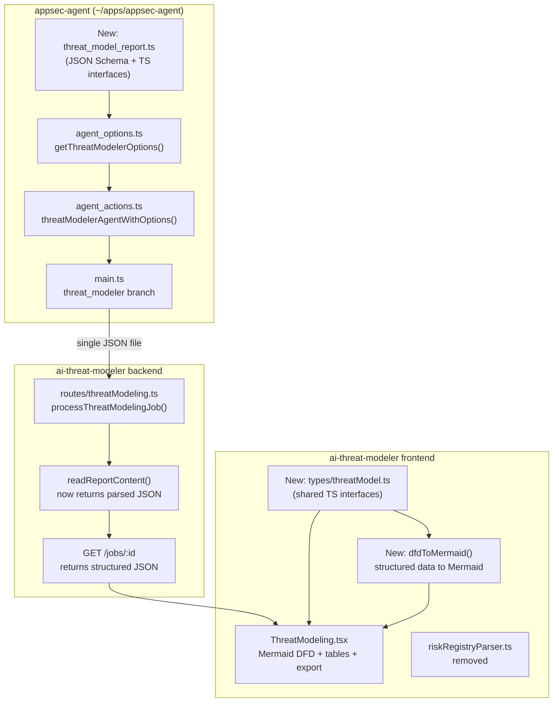

# Threat Model Data Schema Refactoring: Markdown to JSON

> **Status:** Proposal / Draft  
> **Date:** Feb 28, 2026  
> **Scope:** `appsec-agent` (~/apps/appsec-agent) + `ai-threat-modeler` (~/apps/ai-threat-modeler)  
> **DFD Rendering:** Option B — structured data only, frontend generates Mermaid deterministically

## Current State Analysis

Today, the threat modeler in `appsec-agent` produces **3 unstructured text/markdown files** written directly to disk by the LLM agent via the `Write` tool:

1. **Data Flow Diagram** — ASCII text diagram (`codebase_data_flow_diagram_text_<timestamp>`)
2. **Threat Model** — STRIDE analysis in free-form markdown (`codebase_threat_model_<timestamp>`)
3. **Risk Registry** — Risk entries in markdown (`codebase_risk_registry_text_<timestamp>`)

This creates several problems:

- Reports are displayed as raw `<pre>` text in the UI (no rich rendering)
- The Risk Registry Excel export relies on a fragile ~250-line markdown parser (`frontend/utils/riskRegistryParser.ts`) that must handle multiple ad-hoc formats
- No structured data means no filtering, sorting, or interactive views
- Export to other formats (CSV, XLSX, PDF) requires brittle text parsing

**By contrast**, the code reviewer and diff reviewer already use structured JSON via the Claude Agent SDK's `outputFormat` with `json_schema` enforcement (see `~/apps/appsec-agent/src/schemas/security_report.ts`). The threat modeler is the only role that lacks this.

---

## Architecture of the Change



---

## Design Decision: DFD Rendering via Mermaid (Option B)

The Data Flow Diagram will be rendered as a **Mermaid flowchart** in the frontend, generated deterministically from structured node/flow/boundary data in the JSON schema. The LLM does NOT produce Mermaid syntax — it only produces structured arrays.

**Why Option B over alternatives:**

- **Single source of truth.** The structured `nodes`, `data_flows`, and `trust_boundaries` arrays serve both data operations (export, cross-referencing threats to components) and visual rendering. No redundancy.
- **Reliable rendering.** A deterministic `dfdToMermaid()` function always produces valid Mermaid. LLM-generated Mermaid inside a JSON string field would be unvalidated free-text — exactly the fragile pattern this refactoring eliminates.
- **Maintainable.** Changing diagram style (layout direction, colors, shapes) means updating one frontend function, not re-prompting the LLM.
- **Cross-referencing.** Threats reference `affected_components` by node/flow ID from the DFD. Risks reference `related_threats` by threat ID. This traceability chain requires stable structured IDs.
- **Lower token cost.** No redundant Mermaid string alongside the structured arrays.

**DFD-to-Mermaid shape mapping (standard DFD notation):**

- `external_entity` — rectangle `[name]`
- `process` — rounded rectangle `("name")`
- `data_store` — cylinder `[("name")]`
- `trust_boundaries` — Mermaid `subgraph`
- `data_flows` — arrows with labels `-->|"description"|`

**Frontend dependencies:**
- `mermaid` — client-side SVG rendering of DFD diagrams
- `jspdf` — PDF document generation
- `svg2pdf.js` — converts Mermaid SVG to vector PDF (crisp at any zoom, small file size)
- `jspdf-autotable` — renders structured tables in PDFs (used for Threat Model and Risk Registry exports)

---

## Phase 1: Define the Threat Model JSON Schema (in `appsec-agent`)

Create a new schema file at `~/apps/appsec-agent/src/schemas/threat_model_report.ts`, following the same pattern as the existing `security_report.ts`.

### Proposed Schema Structure

The schema wraps all 3 report sections into a single JSON document. The DFD section contains only structured data (no diagram text) — Mermaid is generated from this data on the frontend.

```typescript
export interface DFDNode {
  id: string;                        // e.g., "node-001"
  name: string;
  type: 'external_entity' | 'process' | 'data_store';
  description?: string;
}

export interface DFDDataFlow {
  id: string;                        // e.g., "flow-001"
  source: string;                    // node id
  destination: string;               // node id
  description: string;
  protocol?: string;                 // e.g., "HTTPS", "gRPC", "TCP"
  data_classification?: string;      // public, internal, confidential, restricted
}

export interface DFDTrustBoundary {
  id: string;                        // e.g., "tb-001"
  name: string;
  nodes: string[];                   // node ids within boundary
}

export interface ThreatModelReport {
  threat_model_report: {
    metadata: {
      project_name: string;
      scan_date: string;
      methodology: string;           // "STRIDE"
      total_threats_identified: number;
      total_risks_identified: number;
    };
    data_flow_diagram: {
      description: string;           // High-level summary of the system architecture
      nodes: DFDNode[];
      data_flows: DFDDataFlow[];
      trust_boundaries: DFDTrustBoundary[];
    };
    threat_model: {
      executive_summary: string;
      threats: Array<{
        id: string;                   // THREAT-001, THREAT-002, etc.
        title: string;
        stride_category: 'Spoofing' | 'Tampering' | 'Repudiation' | 'Information Disclosure' | 'Denial of Service' | 'Elevation of Privilege';
        severity: 'CRITICAL' | 'HIGH' | 'MEDIUM' | 'LOW';
        affected_components: string[];  // node/flow ids from DFD
        description: string;
        attack_vector?: string;
        impact: string;
        likelihood: 'HIGH' | 'MEDIUM' | 'LOW';
        mitigation: string;
        references?: string[];         // CWE, OWASP, etc.
      }>;
    };
    risk_registry: {
      summary: string;
      risks: Array<{
        id: string;                   // RISK-001, RISK-002, etc.
        title: string;
        category: string;
        stride_category?: string;
        severity: 'CRITICAL' | 'HIGH' | 'MEDIUM' | 'LOW';
        current_risk_score?: string;
        residual_risk_score?: string;
        description: string;
        affected_components?: string[];
        business_impact?: string;
        remediation_plan: string;
        effort_estimate?: string;
        cost_estimate?: string;
        timeline?: string;
        related_threats?: string[];    // threat ids
      }>;
    };
    recommendations?: Array<{
      title: string;
      description: string;
      priority: 'HIGH' | 'MEDIUM' | 'LOW';
    }>;
    conclusion?: string;
  };
}
```

Also define the corresponding `THREAT_MODEL_REPORT_SCHEMA` as a JSON Schema object (same pattern as `SECURITY_REPORT_SCHEMA` in `security_report.ts`).

---

## Phase 2: Update `appsec-agent` to Use Structured Output

### 2a. Update `agent_options.ts`

Modify `getThreatModelerOptions()` to accept `outputFormat` parameter and apply JSON schema enforcement (like `getCodeReviewerOptions()` already does):

```typescript
// In getThreatModelerOptions(), add:
if (outputFormat?.toLowerCase() === 'json') {
  options.outputFormat = {
    type: 'json_schema',
    schema: THREAT_MODEL_REPORT_SCHEMA
  };
}
```

**File:** `~/apps/appsec-agent/src/agent_options.ts` — `getThreatModelerOptions()` (line 125)

### 2b. Update `agent_actions.ts`

Refactor `threatModelerAgentWithOptions()` to capture `structured_output` from the result message (same pattern as `codeReviewerWithOptions()`), instead of relying on the agent to write files via the `Write` tool.

**File:** `~/apps/appsec-agent/src/agent_actions.ts` — `threatModelerAgentWithOptions()` (line 268)

Key change: add `structured_output` capture in the `message.type === 'result'` handler and return it as a string.

### 2c. Update `main.ts`

Change the `threat_modeler` branch (line 355) to:

- Pass `output_format` through to `getThreatModelerOptions()`
- Rewrite the prompt to instruct the LLM to return structured JSON (not write 3 separate files)
- Write the single JSON output file from `structured_output`

**File:** `~/apps/appsec-agent/src/main.ts` — threat_modeler branch (line 355)

### 2d. Update prompt

Replace the current prompt that asks for 3 separate file writes:

```
// Current (line 363):
"Draw the ASCII text based Data Flow Diagram (DFD)... We're looking for 3 reports
in the current working directory as the deliverable."
```

With one that instructs structured JSON output:

```
"Analyze the codebase and produce a comprehensive threat model report as structured
JSON. Include: (1) a Data Flow Diagram with nodes, data flows, and trust boundaries,
(2) a STRIDE threat analysis, and (3) a risk registry with remediation plans. Return
the complete analysis as your structured JSON response."
```

---

## Phase 3: Update `ai-threat-modeler` Backend

### 3a. Change report storage strategy

Currently 3 separate text files are collected by filename pattern matching (lines 746-780 in `routes/threatModeling.ts`). With JSON output, the agent will produce **one JSON file**.

Update `backend/src/routes/threatModeling.ts`:

- After agent execution, look for the single `.json` output file
- Parse it to validate it matches the schema
- Store the JSON file in `threat-modeling-reports/{jobId}/`
- Update the DB record with the single report path (keep backward compat columns)

### 3b. Update the GET `/jobs/:id` endpoint

Instead of returning raw text content, return the parsed JSON sections directly:

```typescript
// Parse the JSON report and return structured sections
const report = JSON.parse(reportContent);
res.json({
  job: {
    ...jobFields,
    dataFlowDiagram: report.threat_model_report.data_flow_diagram,
    threatModel: report.threat_model_report.threat_model,
    riskRegistry: report.threat_model_report.risk_registry,
    metadata: report.threat_model_report.metadata,
  }
});
```

**File:** `backend/src/routes/threatModeling.ts` — GET `/jobs/:id` handler (line 1158)

### 3c. Add export endpoints

- `GET /reports/:jobId/export?format=json` — Return the raw JSON report
- `GET /reports/:jobId/export?format=csv` — Server-side CSV generation from structured data (no more fragile client-side markdown parsing)

---

## Phase 4: Update `ai-threat-modeler` Frontend

### 4a. Create shared TypeScript types

Create `frontend/types/threatModel.ts` with interfaces matching the JSON schema (or import from `appsec-agent` if feasible).

### 4b. Add Mermaid rendering and DFD-to-Mermaid converter

**New dependency:** `npm install mermaid` in the frontend.

Create `frontend/utils/dfdToMermaid.ts` — a deterministic function that converts structured DFD data to a Mermaid flowchart string:

```typescript
import type { DFDNode, DFDDataFlow, DFDTrustBoundary } from '@/types/threatModel';

export function dfdToMermaid(
  nodes: DFDNode[],
  dataFlows: DFDDataFlow[],
  trustBoundaries: DFDTrustBoundary[]
): string {
  const lines: string[] = ['flowchart LR'];

  // Collect nodes that belong to a trust boundary
  const boundaryNodes = new Set(trustBoundaries.flatMap(tb => tb.nodes));

  // Render trust boundaries as subgraphs (with their contained nodes)
  for (const tb of trustBoundaries) {
    lines.push(`  subgraph ${tb.id} ["${tb.name}"]`);
    for (const nodeId of tb.nodes) {
      const node = nodes.find(n => n.id === nodeId);
      if (node) lines.push(`    ${renderNode(node)}`);
    }
    lines.push('  end');
  }

  // Render nodes not in any trust boundary
  for (const node of nodes) {
    if (!boundaryNodes.has(node.id)) {
      lines.push(`  ${renderNode(node)}`);
    }
  }

  // Render data flows as edges
  for (const flow of dataFlows) {
    const label = flow.protocol
      ? `${flow.description} (${flow.protocol})`
      : flow.description;
    lines.push(`  ${flow.source} -->|"${label}"| ${flow.destination}`);
  }

  return lines.join('\n');
}

function renderNode(node: DFDNode): string {
  switch (node.type) {
    case 'external_entity': return `${node.id}["${node.name}"]`;
    case 'process':         return `${node.id}("${node.name}")`;
    case 'data_store':      return `${node.id}[("${node.name}")]`;
    default:                return `${node.id}["${node.name}"]`;
  }
}
```

Create a reusable `MermaidDiagram` React component that calls `mermaid.render()` to produce an SVG from the Mermaid string. This can be used in the DFD tab and potentially elsewhere.

### 4c. Update `ThreatModeling.tsx`

**File:** `frontend/components/ThreatModeling.tsx`

#### Update `ThreatModelingJob` interface (line 43)

The job interface changes from string content fields to structured objects:

```typescript
// Remove these string fields:
//   dataFlowDiagramContent?: string | null
//   threatModelContent?: string | null
//   riskRegistryContent?: string | null
//   reportContent?: string | null

// Replace with structured data:
interface ThreatModelingJob {
  // ... existing fields (id, status, repoPath, etc.)
  dataFlowDiagram?: DataFlowDiagram | null
  threatModel?: ThreatModel | null
  riskRegistry?: RiskRegistry | null
  metadata?: ReportMetadata | null
}
```

#### Tab 1: Data Flow Diagram (line 748)

**Current:** ASCII text in `<pre>` tag.

**New:**
- Render an interactive Mermaid SVG diagram via `MermaidDiagram` component, using `dfdToMermaid(nodes, dataFlows, trustBoundaries)` to generate the Mermaid string
- Below the diagram, show a collapsible structured table of nodes (name, type, description) and data flows (source, destination, protocol, classification)
- Download buttons:
  - **PDF export** (primary) — using `jspdf` + `svg2pdf.js` for vector-quality output. The PDF includes: header with project name and scan date (from `metadata`), DFD description text, the Mermaid diagram as a vector graphic, and a node/data flow summary table. Vector PDF ensures the diagram stays crisp at any zoom level and prints cleanly.
  - **SVG/PNG export** — Mermaid native export for users who want the raw diagram image
  - **JSON export** — download the raw structured DFD data

#### Tab 2: Threat Model (line 773)

**Current:** Free-form markdown in `<pre>` tag, with `reportContent` fallback.

**New:**
- Display `executive_summary` as a text block at the top
- Render `threats[]` as a sortable/filterable table or card list:
  - Columns: ID, Title, STRIDE Category (tag/badge), Severity (color-coded badge), Likelihood, Affected Components (linked to DFD node IDs), Impact, Mitigation
  - Sortable by severity, STRIDE category, likelihood
  - Optional: filter by STRIDE category or severity level
- References (CWE, OWASP) shown as chips/links on each threat
- Remove the `reportContent` fallback (no backward compat needed)
- Download buttons:
  - **PDF export** — using `jspdf` (already a dependency for DFD). The PDF includes: header with project name and scan date, executive summary, and a formatted threats table with severity/STRIDE columns. Uses `jspdf-autotable` plugin for clean table rendering in the PDF.
  - **JSON export** — download the raw structured threat model data

#### Tab 3: Risk Registry (line 798)

**Current:** Markdown in `<pre>` tag, plus `parseRiskRegistry()` -> CSV export.

**New:**
- Display `summary` as a text block at the top
- Render `risks[]` as a sortable table:
  - Columns: ID, Title, Category, STRIDE, Severity (color-coded badge), Description, Business Impact, Remediation Plan, Effort, Cost, Timeline
  - Sortable by severity, category
  - `related_threats` shown as clickable links/badges that cross-reference to Tab 2
- Export to Excel: direct map from typed `risks[]` array to CSV rows — no markdown parser involved
- `parseRiskRegistry()` and `riskRegistryParser.ts` are fully removed

### 4d. Simplify export logic

- Remove `frontend/utils/riskRegistryParser.ts` — no longer needed; structured JSON data is directly mappable to rows
- Excel/CSV export becomes trivial: map risk/threat objects to rows directly from typed arrays
- Add JSON export button (download the raw structured report)
- Add SVG/PNG export for the Mermaid DFD diagram (Mermaid supports this natively)

### 4e. No backward compatibility needed

The parent app has nothing deployed yet, so there are no legacy jobs to support. The frontend can do a clean cut-over: remove all `<pre>` plain text rendering, remove `riskRegistryParser.ts` entirely, and assume all report data is structured JSON.

---

## Migration and Compatibility Notes

### ai-threat-modeler (parent app) — no backward compatibility needed

The parent app has nothing deployed yet. This means:

- **Database**: Can consolidate the three separate path columns (`data_flow_diagram_path`, `threat_model_path`, `risk_registry_path`) into a single `report_json_path` column, or keep them but always point to the same JSON file. No migration path for old jobs needed.
- **Frontend**: Clean cut-over to structured JSON rendering. Remove all `<pre>` plain text display and `riskRegistryParser.ts`.
- **Backend**: Can simplify report collection to always expect a single JSON file. No need to support both text and JSON report formats.

### appsec-agent (dependency) — backward compatible

The `appsec-agent` package is used by other apps, so backward compatibility is required:

- **Versioning**: Bump to 1.5.0 (minor version — new capability, no breaking changes).
- **Fallback via `output_format` flag**: The `output_format` flag already exists on `AgentArgs`. When set to `json`, the threat modeler uses structured JSON output with schema enforcement. When set to `md`/`markdown` (or unset), it preserves the current behavior of writing 3 separate text/markdown files via the `Write` tool. Other consumers of `appsec-agent` are unaffected.
- **Exports**: New types (`ThreatModelReport`, `DFDNode`, etc.) and `THREAT_MODEL_REPORT_SCHEMA` are additive exports — existing imports remain unchanged.

---

## Key Files to Modify

### appsec-agent (`~/apps/appsec-agent`)

- `src/schemas/threat_model_report.ts` — **New** — JSON schema + TS interfaces
- `src/agent_options.ts` — Add `outputFormat` to threat modeler options
- `src/agent_actions.ts` — Capture `structured_output` for threat modeler
- `src/main.ts` — New prompt, single JSON file output
- `src/index.ts` — Export new schema types

### ai-threat-modeler (`~/apps/ai-threat-modeler`)

- `frontend/types/threatModel.ts` — **New** — Frontend type definitions
- `frontend/utils/dfdToMermaid.ts` — **New** — Deterministic DFD structured data to Mermaid converter
- `frontend/components/MermaidDiagram.tsx` — **New** — Reusable Mermaid SVG rendering component
- `frontend/components/ThreatModeling.tsx` — Structured rendering with Mermaid DFD + tables + export
- `frontend/utils/riskRegistryParser.ts` — Remove (replaced by structured JSON)
- `frontend/package.json` — Add `mermaid`, `jspdf`, `svg2pdf.js`, `jspdf-autotable` dependencies
- `backend/src/routes/threatModeling.ts` — JSON report collection, parsing, API response

---

## Implementation Checklist

- [ ] Design and create `threat_model_report.ts` with TypeScript interfaces and JSON Schema in `appsec-agent/src/schemas/`
- [ ] Update `getThreatModelerOptions()` in `appsec-agent` to support `outputFormat` with JSON schema enforcement
- [ ] Refactor `threatModelerAgentWithOptions()` to capture `structured_output` instead of relying on file writes
- [ ] Update `main.ts` threat_modeler branch: new prompt, `output_format` passthrough, single JSON file output
- [ ] Update backend `processThreatModelingJob()` to collect and parse single JSON report file
- [ ] Update `GET /jobs/:id` to return parsed JSON sections; add export endpoints
- [ ] Create `frontend/types/threatModel.ts` with shared interfaces
- [ ] Add `mermaid`, `jspdf`, `svg2pdf.js`, `jspdf-autotable` dependencies to frontend
- [ ] Create `frontend/utils/dfdToMermaid.ts` — deterministic DFD-to-Mermaid converter
- [ ] Create `frontend/components/MermaidDiagram.tsx` — reusable Mermaid SVG renderer
- [ ] Update `ThreatModeling.tsx`: Mermaid DFD diagram, threat/risk tables with severity badges, sorting
- [ ] Rewrite export logic: direct JSON-to-CSV mapping for Risk Registry, PDF/SVG/PNG export for DFD via `jspdf` + `svg2pdf.js`, remove `riskRegistryParser.ts`
- [ ] Ensure `appsec-agent` backward compatibility: `output_format=md` preserves existing 3-file markdown behavior for other consumers
